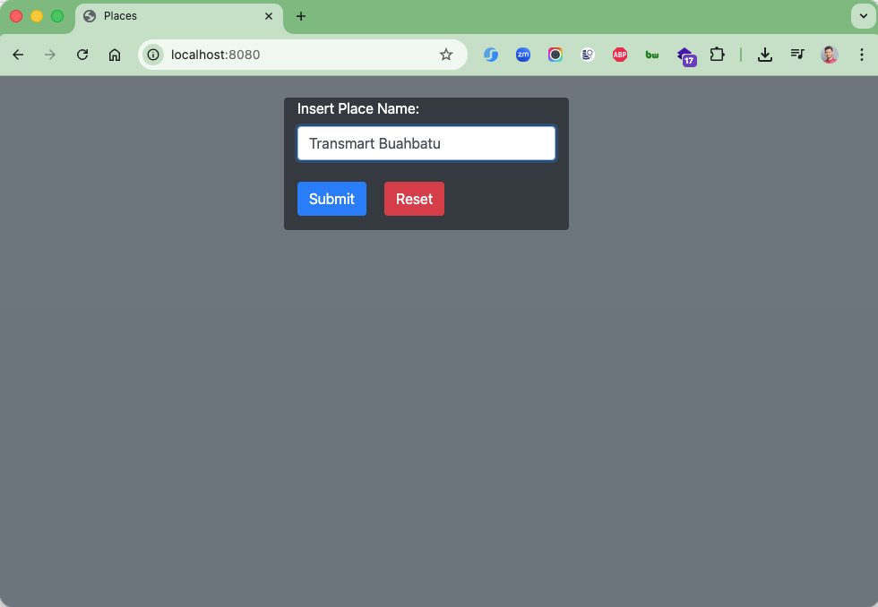
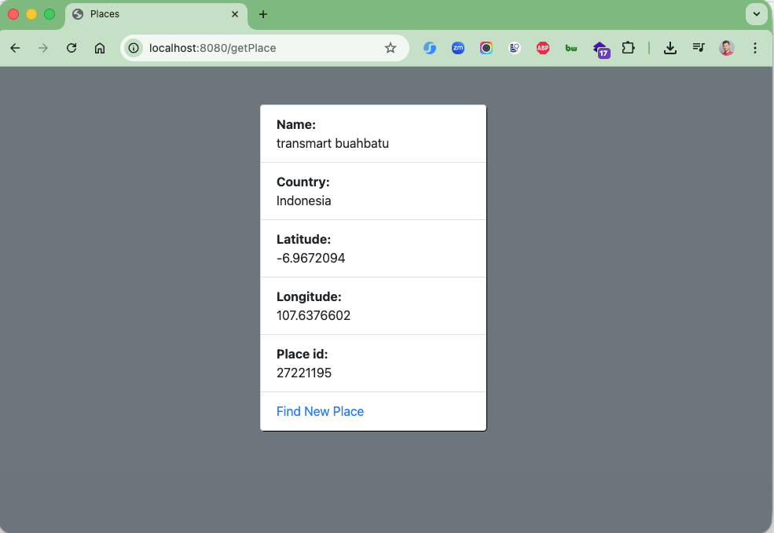
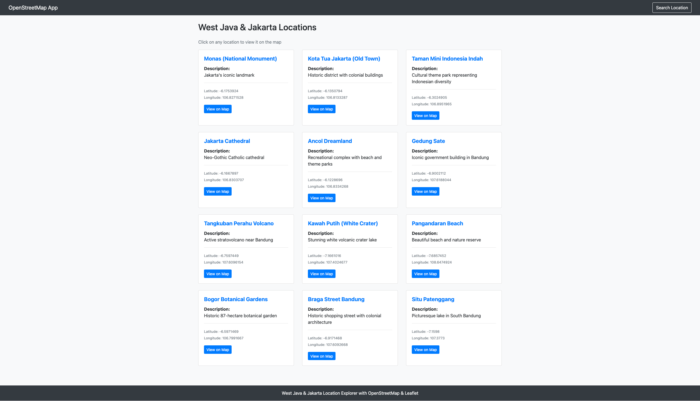
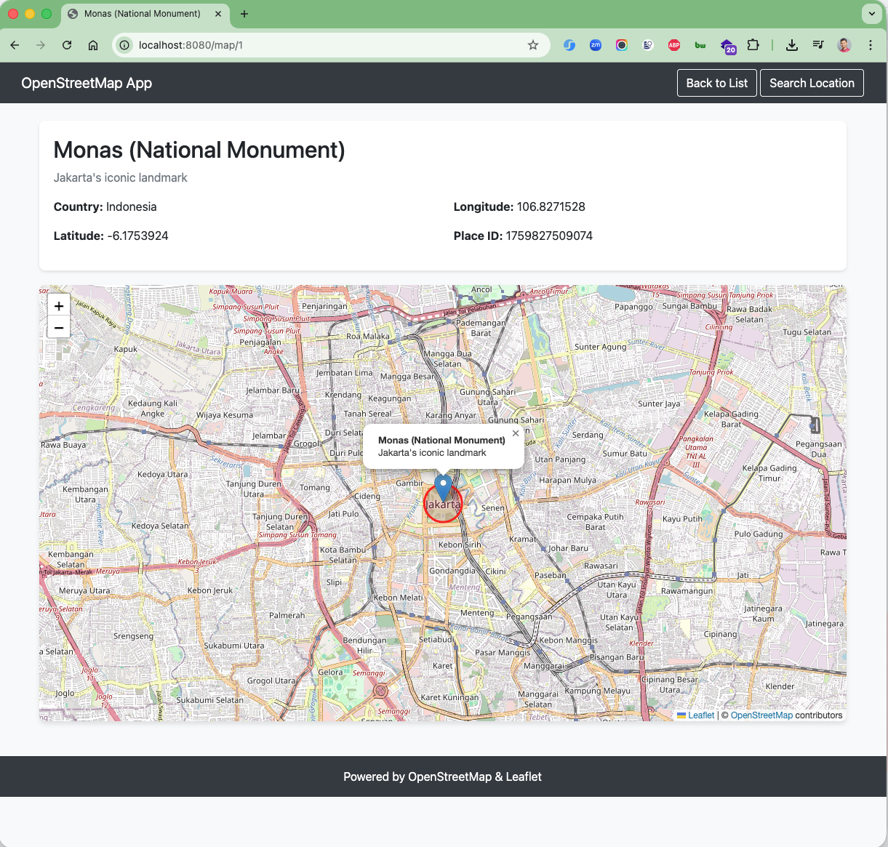

# Spring Boot OpenStreetMap Application

A Spring Boot web application that integrates OpenStreetMap with Leaflet.js to display and manage locations in West Java
and Jakarta, Indonesia. The application features location search, a pre-loaded database of popular landmarks, and
interactive maps.

## Features

- 🗺️ **Interactive Maps**: Leaflet.js integration with OpenStreetMap tiles
- 📍 **Location Database**: Pre-loaded with 12 popular locations in West Java & Jakarta
- 🔍 **Location Search**: Search any location using OpenStreetMap Nominatim API
- 💾 **H2 Database**: In-memory database for storing location data
- 📱 **Responsive UI**: Bootstrap 5-based responsive design
- 🎯 **Location Markers**: Visual markers with popups showing location details
- 🔴 **Radius Circles**: 500m radius circles around each location

## Technologies Used

- **Backend**:
    - Spring Boot 3.5.6
    - Spring Data JPA
    - H2 Database
    - Thymeleaf Template Engine
    - Lombok
    - Java 25

- **Frontend**:
    - Bootstrap 5.3.8
    - Leaflet.js 1.9.4
    - OpenStreetMap Tiles
    - HTML5/CSS3
    - JavaScript

## Pre-loaded Locations

### Jakarta (5 locations)

1. **Monas (National Monument)** - Jakarta's iconic landmark
2. **Kota Tua Jakarta (Old Town)** - Historic district with colonial buildings
3. **Taman Mini Indonesia Indah** - Cultural theme park representing Indonesian diversity
4. **Jakarta Cathedral** - Neo-Gothic Catholic cathedral
5. **Ancol Dreamland** - Recreational complex with beach and theme parks

### West Java (7 locations)

1. **Gedung Sate** - Iconic government building in Bandung
2. **Tangkuban Perahu Volcano** - Active stratovolcano near Bandung
3. **Kawah Putih (White Crater)** - Stunning white volcanic crater lake
4. **Pangandaran Beach** - Beautiful beach and nature reserve
5. **Bogor Botanical Gardens** - Historic 87-hectare botanical garden
6. **Braga Street Bandung** - Historic shopping street with colonial architecture
7. **Situ Patenggang** - Picturesque lake in South Bandung

## Getting Started

### Prerequisites

- Java 25 or higher
- Maven 3.6+

### Installation

1. Clone the repository:

```bash
git clone https://github.com/yourusername/spring-boot-open-street-map.git
cd spring-boot-open-street-map
```

2. Build the project:

```bash
mvn clean install
```

3. Run the application:

```bash
mvn spring-boot:run
```

Or run the JAR file:

```bash
java -jar target/open-street-map-0.0.1-SNAPSHOT.jar
```

4. Access the application:

- Main page: http://localhost:8080/
- Location list: http://localhost:8080/locations
- H2 Console: http://localhost:8080/h2-console

### H2 Database Configuration

To access the H2 console:

- URL: `http://localhost:8080/h2-console`
- JDBC URL: `jdbc:h2:mem:locationdb`
- Username: `sa`
- Password: (leave empty)

## Application Structure

```
spring-boot-open-street-map/
├── src/
│   ├── main/
│   │   ├── java/
│   │   │   └── id/my/hendisantika/openstreetmap/
│   │   │       ├── controller/
│   │   │       │   └── MainController.java
│   │   │       ├── model/
│   │   │       │   └── Location.java
│   │   │       ├── repository/
│   │   │       │   └── LocationRepository.java
│   │   │       ├── service/
│   │   │       │   └── LocationService.java
│   │   │       └── SpringBootOpenStreetMapApplication.java
│   │   └── resources/
│   │       ├── templates/
│   │       │   ├── locationInterface.html (Search page)
│   │       │   ├── locations.html (Location list)
│   │       │   ├── map.html (Map view)
│   │       │   └── details.html (Search results)
│   │       └── application.properties
│   └── test/
├── pom.xml
└── README.md
```

## Endpoints

| Endpoint      | Method | Description                               |
|---------------|--------|-------------------------------------------|
| `/`           | GET    | Home page with location search            |
| `/getPlace`   | POST   | Search location via OpenStreetMap API     |
| `/locations`  | GET    | List all pre-loaded locations             |
| `/map/{id}`   | GET    | View specific location on interactive map |
| `/h2-console` | GET    | H2 database console                       |

## Usage

### 1. Search Any Location

- Navigate to the home page (`/`)
- Enter any location name in the search box
- Click "Submit" to search via OpenStreetMap Nominatim API
- View the location details

### 2. Browse Pre-loaded Locations

- Click "View West Java & Jakarta Locations" button
- Browse through 12 pre-loaded popular locations
- Click on any location card to view it on the map

### 3. View on Interactive Map

- From the location list, click "View on Map" button
- See the location with:
    - Interactive Leaflet map
    - Location marker with popup
    - 500m radius circle
    - Zoom/pan controls

## Configuration

### application.properties

```properties
spring.application.name=spring-boot-open-street-map
# H2 Database Configuration
spring.datasource.url=jdbc:h2:mem:locationdb
spring.datasource.driverClassName=org.h2.Driver
spring.datasource.username=sa
spring.datasource.password=
# JPA Configuration
spring.jpa.database-platform=org.hibernate.dialect.H2Dialect
spring.jpa.hibernate.ddl-auto=create-drop
spring.jpa.show-sql=true
# H2 Console Configuration
spring.h2.console.enabled=true
spring.h2.console.path=/h2-console
```

## API Integration

### OpenStreetMap Nominatim API

The application uses the Nominatim API for location search:

- Endpoint: `https://nominatim.openstreetmap.org/`
- Free to use with attribution
- Returns geocoded location data (latitude, longitude, country, etc.)

### Leaflet.js CDN

Maps are powered by Leaflet.js loaded from CDN:

- CSS: `https://unpkg.com/leaflet@1.9.4/dist/leaflet.css`
- JS: `https://unpkg.com/leaflet@1.9.4/dist/leaflet.js`

## Screenshots

### Home Page

Search for any location using OpenStreetMap API

### Location List

Browse pre-loaded West Java & Jakarta locations

### Interactive Map

View locations on Leaflet-powered OpenStreetMap

## Development

### Adding New Locations

Edit `LocationService.java` and add locations in the `initData()` method:

```java
locationRepository.save(createLocation(
                                "Location Name",
    "latitude",
                                "longitude",
                                "Country",
                                "Description"
));
```

### Customizing Map Appearance

Edit `map.html` to customize:

- Map zoom level (default: 13)
- Circle radius (default: 500m)
- Circle color (default: red)
- Tile layer style

### Image Screenshots

Insert Placeholder



Placeholder



List Maps on West Java & Jakarta



MapsetView



## Contributing

1. Fork the repository
2. Create a feature branch (`git checkout -b feature/amazing-feature`)
3. Commit your changes (`git commit -m 'Add some amazing feature'`)
4. Push to the branch (`git push origin feature/amazing-feature`)
5. Open a Pull Request

## License

This project is licensed under the MIT License - see the LICENSE file for details.

## Acknowledgments

- [OpenStreetMap](https://www.openstreetmap.org/) - Map data and tiles
- [Leaflet.js](https://leafletjs.com/) - Interactive map library
- [Nominatim](https://nominatim.openstreetmap.org/) - Geocoding API
- [Spring Boot](https://spring.io/projects/spring-boot) - Application framework
- [Bootstrap](https://getbootstrap.com/) - UI framework

## Contact

- Developer: Hendi Santika
- Email: hendisantika@yahoo.co.id
- Telegram: @hendisantika34
- Link: [s.id/hendisantika](https://s.id/hendisantika)

## Troubleshooting

### Map not displaying

- Ensure you have an active internet connection (Leaflet loads from CDN)
- Check browser console for JavaScript errors
- Verify OpenStreetMap tiles are accessible

### Database issues

- H2 database is in-memory and resets on restart
- Check `application.properties` for correct configuration
- Access H2 console to verify data

### Build issues

- Ensure Java 25 is installed: `java -version`
- Clear Maven cache: `mvn clean`
- Rebuild: `mvn clean install`
